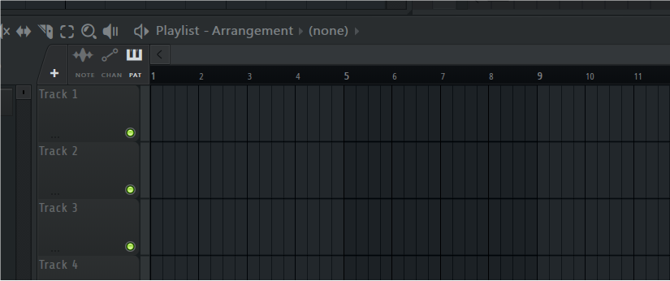
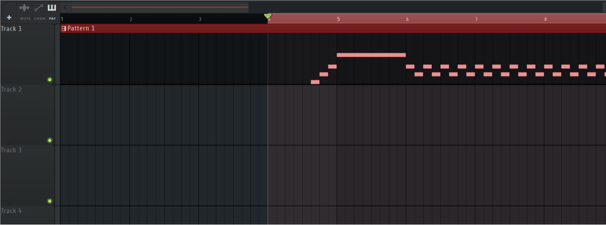

这是一个用于将MIDI文件和脚本转换为视频的工具

# 依赖

硬性需求 `moviepy>=2.0` 和 最新的 [`melody_machine`](https://github.com/GrayFL/MelodyMachine)

# 使用方式

```cmd
>>> python run.py YourScript.md
```

手稿中请先将所有必要的参数写完整。此外，默认的配置文件在 `./midiscript_videoifier/configs/default.py` ，手稿中的yaml参数可以覆盖默认配置文件

旧版本还遗留了一个单py文件 `./MidiVideoifier.py` ，除了性能稍差，以及一些默认参数没有更新外具备整个项目的完整功能（不依赖于 `melody_machine`）。

# 一些定义

## 关于小节时间（tBar）、音乐时间（tTrk）、视频时间（tMov）

在Fl studio中，小节记数是从 1 开始的，小节时间可以理解为Fl studio工程中的坐标。编写手稿时，方便起见采用和软件中相同的记法，减少人力的换算。音乐时间则代表了Midi文件和对应音频文件的播放时间（秒）；视频时间就是音乐时间加上开头的封面所占用的音频室外的时间。



此外，实际操作中可能会遇到这样的情况：



注意到，框选部分以当前时间线作为起点（4），而小节标记是以总工程作为起点（1）。

因此，本程序给出了一个外部参数 `StartBar` ，即音频导出范围的起点（小节时间），用以作修正。具体而言，在解析手稿时，会将第一个段落参数减去 `StartBar` 这个偏置量。

此外，关于视频横轴显示的小节记数的起点可以通过 `InitBar` 指定，比如当该值设置为 1 时，视频的小节起点就是 1 。

音乐时间则是从音频的起点开始，以秒做单位。视频时间同理，只是从视频起始开始。二者发生差异是因为片头大标题的存在，其持续时长为 `BeginTime`。当忽略片头时二者就等价了。

## 关于 tick step beat bar

tick是Midi事件中的最小时间单位。FL中的时基（timebase）就是指的 ticks per beat (tpb) ，即每beat包含的tick数。通常来说，`tpb` 取值默认为96。

step是FL工程中的最小可视单位，一个beat通常包含4个step。

beat是一个音乐的概念，即节拍。但在实际编写工程时，出于多方面的考量，实际上并不能完全等同。比如常见的4/4拍，毫无疑问就是一个小节有四拍，每拍长度为4分音符；3/4拍，一个小节有3拍，每拍长一个四分音符；但是，比如If elephant can fly这种类似一小节4拍单每拍三个子拍的6/8拍或者4/4而言，如果按照6/8记数，使用节拍标记（Midi的内部定义）会导致1/8分音符内部可分数量变少，使用FL工程分割steps per beat = 4 or 8、beats per bar = 6会使得曲速过快（FL的节拍器打在beat上）。那么最合适的方案反而是使用4/4和工程分割，steps per beat = 6 or 12、beats per bar = 4，这样虽然只有4拍，但内部可以按需分割子节拍。比如上述的 6+4组合，就可以代表 `|xoo|xoo|xoo|xoo|` 这样的节奏。

Bar是小节，一般来说1个Bar会有4个beat

# 手稿编写格式

文档的整体组织可以分为：前言+文本段落

前言中定义了文段中的各种参数

```yaml
StartBar': 5,  # .flp工程中的音频实际起始小节号
InitBar': 1,  # 视频中的起始记数小节号
BeginTime': 1,  # 开幕大标题的显示时长（秒）
CountDown': 3,  # 倒计时个数
Title': '',  # 开幕大标题文本
Saying': '',  # 开幕格言文本
Name': '—— Gray Frezicical',  # 落款
h': 1080,  # 视频的高度（像素）
w': 2160,  # 视频的宽度（像素）
FontPath':  # 字体路径  \
'C:/Users/Gray/AppData/Local/Microsoft/Windows/Fonts/sarasa-mono-sc-regular.ttf',
spb': 4,  # steps per beat
bpB': 4,  # beats per Bar
bpM': 120,  # beats per Minutes
tpb': 96,  # ticks per beat / timebase
pitch_clip_range': [33, 93],  # 全局音符音高范围[A2,A7]
expand_range': [4, 4],  # 音高上下拓展显示范围
min_pitch_range': [10, 10],  # 音高上下最小范围
subclip_tBar': None,  # 输出视频的裁剪范围（小节）
subclip_tMov': None,  # 输出视频的裁剪范围（秒）
```

值得注意的是，这里的参数格式不是yaml或者json，而是原生python。在解析时会使用 `eval()` 直接运行后面的文本。所以字符串一定记得加上引号

正文部分分为控制字和文本，形如

```markdown
# `16~17`

这次来聊聊弗拉门戈

# `17~21` `LABS Lead` `! pitch_clip_range = [0,100]`

上次说到弗里吉亚调式，放在白键上就是：
3 4 5 6 7 1 2 3
iii - IV 带来一种阴森的感觉

# `21~25` `same`

如果把 5 变成 #5 ，就可以得到弗里吉亚属（大弗里吉亚）
3 4 #5 6 7 1 2 3 （在弗拉门戈中称为安达卢西亚音阶）
听感会变得更柔和些

# `25~29` `LABS Chord`

此时，它不仅保留了开头的半音关系
也提供了 III、IV 两个半音关系的调内大和弦；
这样的特点带来一种神秘的异域色彩

# `29~33` `LABS Chord, LABS Lead` `28.5~37`

由此构成了经典进行：
vi - V - IV - III
```

控制字最多由四段构成。

其中第一段表示该正文段显示的始末小节序号，与FL工程中的小节序号完全统一，这个参数是必须的。该控制字可以以绝对和相对两种方式表示。绝对表示需要使用 `~` 或者 `,` 分隔两个小节时间（tBar）；相对表示法使用 `+` 跟着一个数字的方式表示相对于上一个正文段继续持续多少个小节时间。小节时间可以是小数。

第二段表示从Midi文件中选择的乐器轨道的名称和其替代显示名称。乐器与乐器的分隔符使用 `,` 或 `;` ，原名和替代名使用 `:` 分隔，整体形似一个字典。此外，该参数支持 `same` 关键字，表示沿用上一个段落的相同控制字。

第三段可以是Midi选取范围或者其他参数。若指定为Midi选取范围，则第四位就是其他参数。Midi选取范围的格式除了不支持相对标记，其他与正文显示范围（第一段控制字）都相同。该参数也支持 `same` 关键字。使用该关键字时默认表示Midi选取范围。

其他参数主要是正文段的内部属性，最常用的是 `pitch_clip_range` ，即音高裁剪范围。所有的参数赋值语句需要以 `!` 开头，赋值语法和Python内相同。
